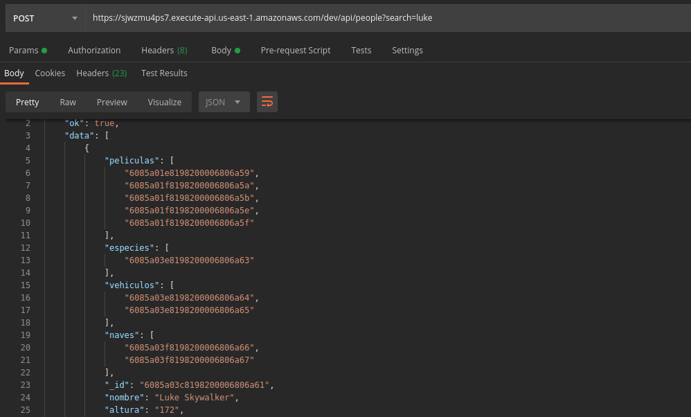
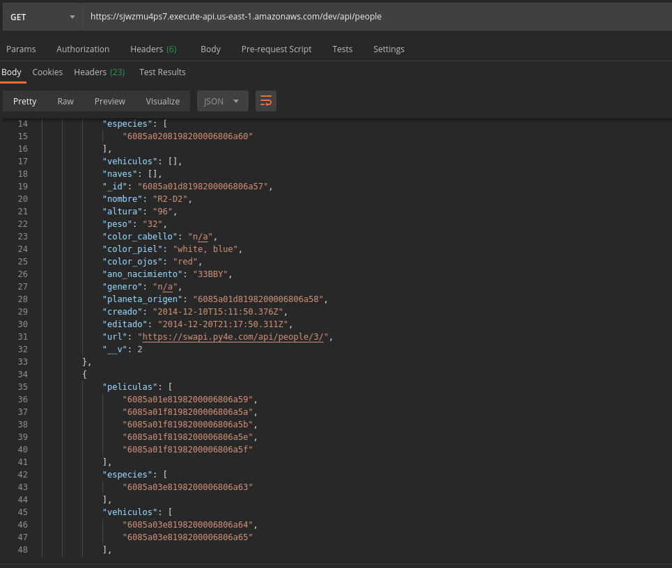
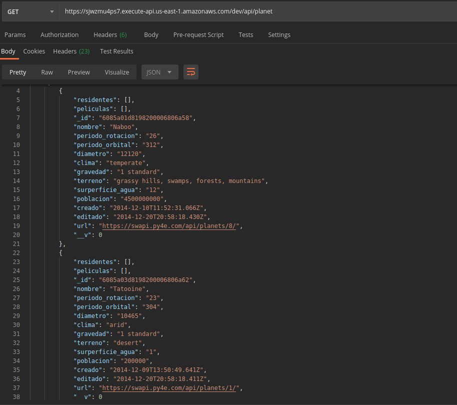
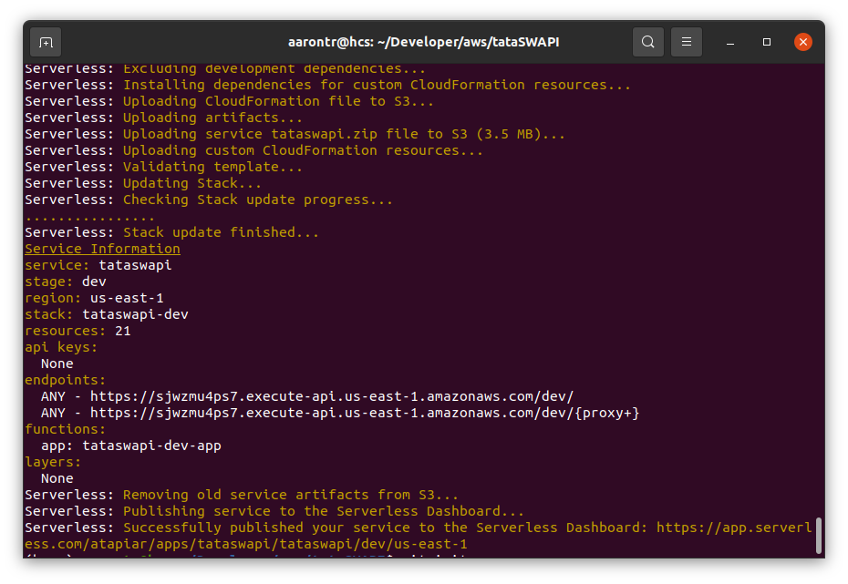

# TATA-SWAPI
API that loads the information from StarWars API by querying a character, and displays the loaded information in a database.

## System requirements
* Node.js v15.x or later
* Framework Core: 2.38.0
* npm v7.5.x or later
* git v2.25.1 or later

## Programming Language
* JavaScript

## Dependencies
* axios: ^0.21.1,
* body-parser: ^1.19.0,
* express: ^4.17.1,
* helmet: ^4.5.0,
* mongoose: ^5.12.5,
* serverless-http: ^2.7.0

## How to run it?
1. Clone repository
    > `git clone https://github.com/aarontr24/tata_swapi`
2. Go directory
    > `cd tata_swapi`
3. Install dependencies
    > `npm install`
4. Deploy project
    > `sls deploy`

## Endpoints

1. Upload information by searching for the name of a character using the POST endpoint
    * POST:

    https://sjwzmu4ps7.execute-api.us-east-1.amazonaws.com/dev/api/people?search=luke

2. Get the information stored in the models using the GET endpoints
    * GET:

    * people: https://sjwzmu4ps7.execute-api.us-east-1.amazonaws.com/dev/api/people
    * planets: https://sjwzmu4ps7.execute-api.us-east-1.amazonaws.com/dev/api/planet
    * films: https://sjwzmu4ps7.execute-api.us-east-1.amazonaws.com/dev/api/film
    * species: https://sjwzmu4ps7.execute-api.us-east-1.amazonaws.com/dev/api/species
    * vehicles: https://sjwzmu4ps7.execute-api.us-east-1.amazonaws.com/dev/api/vehicle
    * starships: https://sjwzmu4ps7.execute-api.us-east-1.amazonaws.com/dev/api/starship

## Screenshots
+POST - search=luke!

+GET

+CONSOLE

